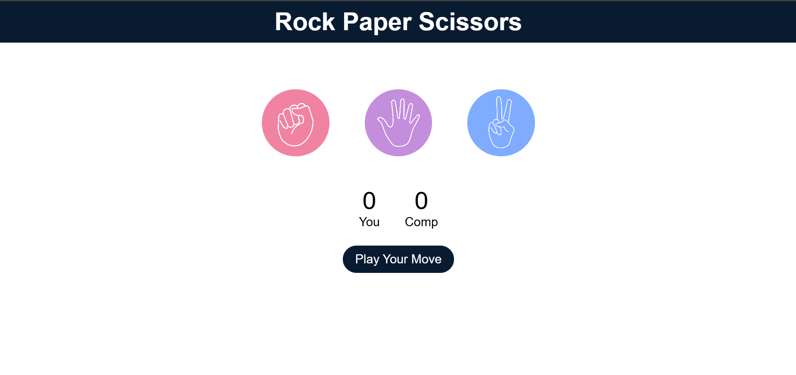

# 🎮 Rock Paper Scissors Game

### 🔗 Live Demo 
[Play the game](https://souravsaini001.github.io/RockPaperScissor/) 

A fun and interactive **Rock Paper Scissors** game built using **HTML**, **CSS**, and **JavaScript**. Play against the computer and see who wins!



---

## 🚀 Features

- 🖱️ Click to choose Rock, Paper, or Scissors
- 🧠 Random computer choice
- 🏆 Scoreboard for tracking wins
- 🎯 Result messages for each round
- 📱 Fully responsive for mobile & desktop
- 💅 Clean UI with hover animations

---

## 📁 Project Structure

PROJECT2/
├── Images/                    # Folder containing all game assets
│   ├── rock.png
│   ├── paper.png
│   ├── scissors.png
│   └── screenshotGame.png    # Screenshot for README
│
├── index.html                # Main game layout
├── style.css                 # Styles and responsiveness
├── app.js                    # Game logic and functionality
└── README.md                 # You're here!


---

## 🧠 How the Game Works

- Rock crushes Scissors
- Scissors cuts Paper
- Paper covers Rock
- Same move = Draw

---

## 💻 Run the Game Locally

1. Clone the repo:
   ```bash
   git clone https://github.com/yourusername/project2.git


👨‍💻 Author
Made with ❤️ by Sourav
